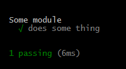
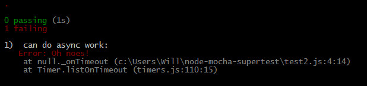

title: Testing Node APIs With Mocha and SuperTest
author:
    email: will@itsananderson.com
    name: Will Anderson
    url: http://willi.am/node-mocha-supertest
    twitter: itsananderson
    github: itsananderson
output: output/index.html
controls: true

---

<script>
  (function(i,s,o,g,r,a,m){i['GoogleAnalyticsObject']=r;i[r]=i[r]||function(){
  (i[r].q=i[r].q||[]).push(arguments)},i[r].l=1*new Date();a=s.createElement(o),
  m=s.getElementsByTagName(o)[0];a.async=1;a.src=g;m.parentNode.insertBefore(a,m)
  })(window,document,'script','//www.google-analytics.com/analytics.js','ga');

  ga('create', 'UA-6776456-2', 'auto');
  ga('send', 'pageview');
</script>

## Testing Node APIs With Mocha and SuperTest

<p style="text-align: center">
Will Anderson  
will@itsananderson.com  
http://willi.am/  
https://github.com/itsananderson  
https://twitter.com/itsananderson  
</p>

---


Where to find these slides:

http://willi.am/node-mocha-supertest

---

#### So you want to write a Node API?

---

#### So you want to write a Node API?

#### Great! How are you going to test it?

---

## Mocha

* http://mochajs.org/
* Simple syntax
* Many supported reporters

---

Test reporters:

`mocha --reporter dot`


---

Test reporters:

`mocha --reporter spec`


---

Test reporters:

`mocha --reporter nyan`


---

Lots more options:


---

A Simple Example:

```javascript
var someModule = require("../");
var assert = require("assert");

describe("Some module", function() {
    it("does some thing", function() {
        assert(someModule.doesSomeThing());
    });
});
```



---

Basic Mocha API:

**`describe`**  
High level grouping (suite) of tests. You can nest `describe` inside another `describe`  

**`it`**  
A single test function. Usually tests one feature or edge case

---

```javascript
describe("My feature", function() {
    describe("subfeature 1", function() {
        it("does one thing", function() {
        });

        it("does another thing", function() {
        });
    });

    describe("subfeature 2", function() {
        it("does one thing", function() {
        });

        it("does another thing", function() {
        });
    });
});
```

---


--

Advanced Mocha hooks:

**`before`**  
Run once before all tests in a test suite  
**`after`**  
Run once after all tests in a test suite  

---

Advanced Mocha hooks:

**`beforeEach`**  
Run before every test in a test suite  
**`afterEach`**  
Run after every test in a test suite

---

A note on async code:

```javascript
it('can do async work', function(done) {
    setTimeout(function() {
        done();
    }, 1000);
});
```

---

A note on async code:

```javascript
it('can do async work', function(done) {
    setTimeout(done, 1000);
});
```

---

The `done` callback can handle errors

```javascript
it('can do async work', function(done) {
    setTimeout(function() {
        done(new Error("Oh noes!");
    }, 1000);
});
```



---

## Testing an API

---

Simple API server:

```javascript
var express = require("express");
var app = express();

app.get("/", function(req, res) {
    res.send({ message: "Hello, World!" });
});

app.get("/foo", function(req, res) {
    res.send({ message: "foo foo" });
});

app.listen(process.env.PORT || 3000);
```

---

Simple test:

```javascript
var assert = require("assert");
var request = require("request");

require("./server");

describe("Server", function() {
    it("responds with JSON message 'Hello, World!' at the root", function(done) {
        request("http://localhost:3000", function(err, response, body) {
            if (err) done(err);

            var payload = JSON.parse(body);
            assert.equal(payload.message, "Hello, World!");

            done();
        });
    });
});
```

---

Small problem: port conflicts

```javascript
        request("http://localhost:3000", function(err, response, body) {
```
---

New server:

```javascript
var express = require("express");
var app = express();

app.get("/", function(req, res) {
    res.send({ message: "Hello, World!" });
});

app.get("/foo", function(req, res) {
    res.send({ message: "foo foo" });
});

module.exports = app;
```

---

New tests:

```javascript
var assert = require("assert");
var request = require("request");

var app = require("./server");

var server = app.listen(0);
var port = server.address().port;

describe("Server", function() {
    it("responds with JSON message 'Hello, World!' at the root", function(done) {
        request("http://localhost:" + port + "/", function(err, response, body) {
            if (err) done(err);

            var payload = JSON.parse(body);
            assert.equal(payload.message, "Hello, World!");

            done();
        });
    });
});
```

---

Isolating server for each test:

```javascript
var request = require("request");
var app = require("./server");

describe("API Server", function() {
    var server;
    var port;
    beforeEach(function(done) {
        server = app.listen(0, done);
        port = server.address.port();
    });
    
    afterEach(function() {
        server.stop();
    });
    
    // ...
```

---

## Supertest

* Takes care of server setup and teardown
* Simplifies request and response validation
* Makes tests easier to read

---

Before supertest

```javascript
var app = reqiure("../");
var request = require("request");
var assert = require("assert");

// server setup

it("Responds with 'Hello, World!'", function(done) {
    request("http://localhost:" + port + "/", function(response, body) {
        assert.equal(response.statusCode, 200);
        assert.equal(body, "Hello, World!");
        done();
    });
});
```

---

After supertest:

```javascript
var app = require("../");
var supertest = require("supertest")(app);

it("Responds with 'Hello, World!'", function(done) {
    supertest
        .get("/")
        .expect(200)
        .expect("Hello, World!")
        .end(done);
});
```

---

Testing JSON responses:

```javascript
supertest
    .get("/json")
    .expect(200)
    .expect({
        message: "Hello, World!"
    })
    .end(done);
```

---

Testing responses with a RegEx:

```javascript
supertest
    .get("/")
    .expect(200)
    .expect(/Hello.*/)
    .end(done);
```

---

Testing responses with a custom validator function:

```javascript
supertest
    .get("/nav")
    .expect(200)
    .expect(function(res) {
        assert(res.body.prev, "Expected prev link");
        assert(res.body.next, "Expected next link");
    })
    .end(done);

```

---

Lots more validation examples:

https://github.com/visionmedia/supertest#api

---

Testing external APIs

```javascript
var supertest = require("supertest")("http://www.google.com/");

// http://google.com/foo
supertest.get("/foo")
    .end();

// http://google.com/search?q=test
supertest.get("/search?q=test")
    .end();
```

---

Other supertest examples


```javascript
// Uploading a file
supertest
    .post("/upload")
    .attach("fieldName", "path/to/file.jpg")
    .end();
```

---

Other supertest examples

```javascript
// Set a header and send a JSON body
supertest
    .post("/foo")
    .set("Content-Type", "application/json")
    .send({
        message: "Hello, Server!"
    })
    .end();
```

---

Other challenges:

* Database is slow, unavailable in testing environment (e.g. Travis CI)
* External resources are sometimes unpredictable
* Hard to test edge cases

---

## Inversion of Control

* https://en.wikipedia.org/wiki/Inversion_of_control
* Components don't construct their own dependencies
* Decouples your application
* Drastically simplifies testing
* Related: Dependency Injection

---

Before IoC:

```javascript
function UserManager() {
    this.db = new DBConnection("username", "password");
}

UserManager.prototype.createUser = function(username, password) {
    var user = this.db.users.create(username, hash(password));
};

// ...
```

---

After IoC:

```javascript
function UserManager(dbConnection) {
    this.db = dbConnection;
}

UserManager.prototype.createUser = function(username, password) {
    var user = this.db.users.create(username, hash(password));
};

// ...
```

---

Testing a component with IoC:

```javascript
var UserManager = require("./user-manager");

describe("UserManager", function() {
    it("hashes passwords when creating users", function() {
        var fakeDbConnection = {
            users: {
                create: function(username, password) {
                    assert.equal(password, hash("1234"));
                }
            }
        };
        var manager = new UserManager(fakeDbConnection);
        manager.createUser("foo", "1234");
    });
});
```

---

Composing Express middleware:

```javascript
var users = require("./routes/users");
var friends = require("./routes/friends");
var messages = require("./routes/messages");
var auth = require("./routes/auth");

var app = require("express")();

app.use(auth.router());
app.use(users);
app.use(auth.authenticate(), friends);
app.use(auth.authenticate(), messages);

app.listen(process.env.PORT || 3000);
```

---

Testing Express middleware:

```javascript
var app = require("express")();
var messages = require("../routes/messages");

// Stub out a fake user
app.use(function(req, res, next) {
    req.user = {
        id: 1
    };
    next();
});

app.use(messages); // No authentication

var supertest = require("supertest")(app);


// ... mocha tests
```

---

## Sinon.JS

<p style="text-align: center">
http://sinonjs.org/
</p>

* Stubs
* Spies
* Mocks

---

## Sinon Stubs

## http://sinonjs.org/docs/#stubs

---

```javascript
// Create a single function
var returnTrue = sinon.stub().returns(true);
var returnFalse = sinon.stub().returns(false);
var throwsError = sinon.stub().throws(new Error("some error"));
```

---

```javascript
// Return different values for different inputs
var factorial = sinon.stub();
factorial.withArgs(1).returns(1);
factorial.withArgs(2).returns(2);
factorial.withArgs(3).returns(6);
```

---

```javascript
// Modify an object
var stubbed = sinon.stub(dbConnection.users, "findByUsername").returns({
    username: "foo",
    passwrod: hash("1234")
});

stubbed.restore(); // Restore original method
```

---

## Sinon Spies

## http://sinonjs.org/docs/#spies

---

Spy on an anonymous function

```javascript
var callback = sinon.spy();
PubSub.subscribe("message", callback);
PubSub.publishSync("message");
assert(callback.called);
```

---

Spy on an existing function

```javascript
var spyHash = sinon.spy(hash);
var manager = new UserManager(db, spyHash);

manager.validateLogin("foo", "1234"); // Should call hashing function

assert(spyHash.called);
```

---

## Sinon Mocks

## http://sinonjs.org/docs/#mocks

---

```javascript
var dbConnection = new DBConnection("username", "password");
var mockUsers = sinon.mock(dbConnection.users);
mockUsers.expects("create").once().withArgs("foo", hash("1234"));

var manager = new UserManager(dbConnection);
manager.createUser("foo", "1234");

mockUsers.verify();
mockUsers.restore();
```

---

## Bonus Tips

---

Running a single Mocha test:

```javascript
describe("Foo", function() {
    it("test1", function() {});
    it("test2", function() {});
    it("test2", function() {});
});
```

---

Running a single Mocha test:

```javascript
describe("Foo", function() {
    it("test1", function() {});
    it.only("test2", function() {});
    it("test2", function() {});
});
```

---

Running a single Mocha test group:

```javascript
describe.only("Foo", function() {
    it("test1", function() {});
    it("test2", function() {});
    it("test2", function() {});
});
```

---

Custom timeout:

```javascript
describe("Foo", function() {
    it("long test", function(done) {
        this.timeout(10000);
        // do slow async things
        done();
    });
});
```

---

Watch for changes and re-run tests:

`mocha --watch`
